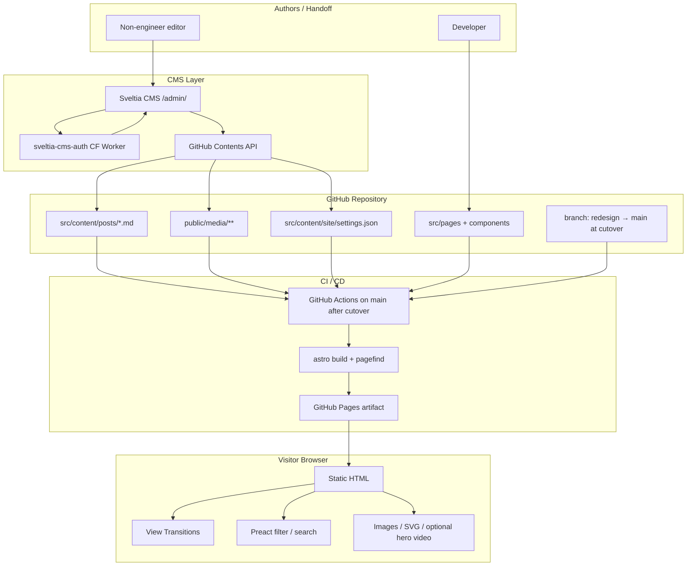
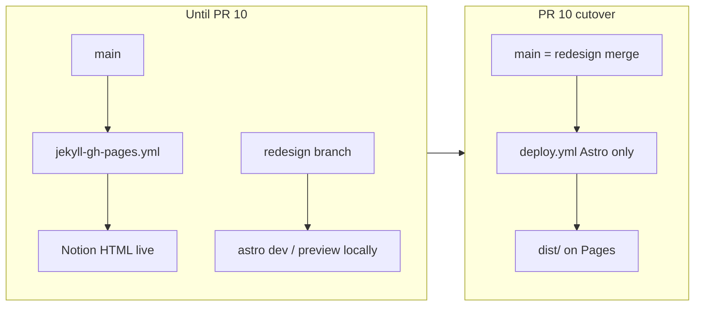
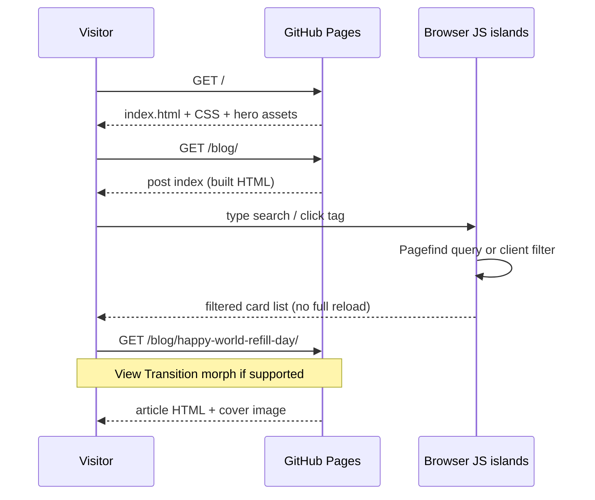
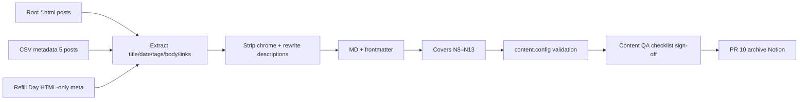
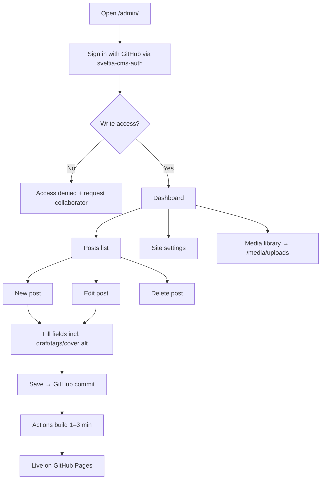
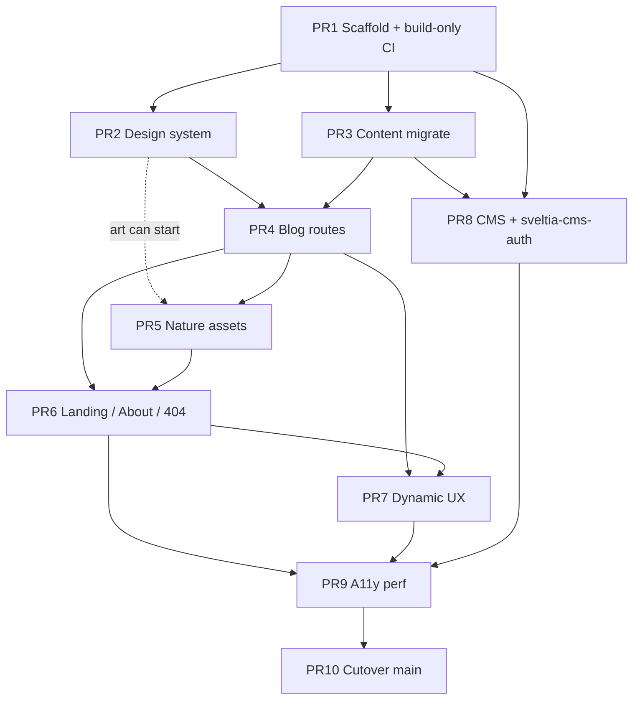

# Redesign: Less Carbon, more notions — Nature-Themed Blog + Static CMS

| Field | Value |
|-------|--------|
| **Document** | Site redesign & architecture |
| **Author** | Design (systems architecture) — owner TBD on cutover |
| **Date** | 2026-08-08 |
| **Status** | Draft (rev 3 — residual review issues addressed) |
| **Repo** | [lesscarbon-morenotions/lesscarbon-morenotions.github.io](https://github.com/lesscarbon-morenotions/lesscarbon-morenotions.github.io) |
| **Local path** | `/Users/sadegh/Documents/GitHub/lesscarbon-morenotions.github.io` |
| **Target host** | GitHub Pages (static) |
| **Integration branch** | `redesign` (all feature work); production cutover only in PR 10 → `main` |

---

## Overview

The public site today is a raw **Notion HTML export**: flat root HTML files, hashed assets, a nested UUID-named folder, leftover Jekyll workflow config, and almost no intentional design. Content and brand voice exist (socio-ecological science, slow exploration, rock-pun persona **B(r)ecc(i)a/Riebeck(it)e**), but the site is not maintainable, not accessible as a reading experience, and not handoff-ready for non-engineers.

This document proposes a full rebuild as a **static, nature-themed personal blog** with:

1. A polished, ecological visual system (hydrangea / cornflower / beluga / butterfly motifs).
2. A clean content model (Markdown + frontmatter) with the six existing posts migrated.
3. SPA-like interaction (search, tag filters, View Transitions, ambient motion) while remaining **100% deployable to GitHub Pages**.
4. A **CMS admin panel** (Sveltia CMS + GitHub backend + official **sveltia-cms-auth** Worker) so non-engineers can create/edit/delete posts, manage tags, media, and site settings via a browser UI that commits to the repo.

**Recommended stack:** **Astro 5 (Content Layer) + Markdown collections + Tailwind CSS 4 + Preact islands + Sveltia CMS + Pagefind + GitHub Actions → GitHub Pages.**

**Branch policy (non-negotiable):** All redesign work lands on **`redesign`**. Production on `main` keeps serving the current Notion export until **PR 10 (cutover)**. PR 1 must not brick the live site.

---

## Background & Motivation

### Current state (repo audit, 2026-08-08)

| Observation | Detail |
|-------------|--------|
| Content origin | Notion export (`class="notion-html"`, `data-block-id`, export chrome like “Drag image to reposition”) |
| Entry points | `index.html`, `less-carbon-more-notions.html` (near-duplicates); root slug HTML for posts |
| Nested debris | `Less Carbon, more notions 894fba88695642bb8fae873621623581/` with CSV metadata, **5** nested post HTML files, large PNGs (~2.8MB folder; one ~2.4MB PNG) |
| Assets | `assets/` hashed Notion CSS/JS/images — **≈ 4.4MB** (not ~9MB); full tree **≈ 15MB** |
| Deploy config | `.github/workflows/jekyll-gh-pages.yml` present; site is **not** a Jekyll project (no `_config.yml`, no `_posts/`) |
| Git history | Last meaningful content push ~2024-09-16; mostly “Add files via upload” |
| Real design | None — browser-default Notion chrome + export CSS |

**Largest files worth archiving/deleting priority (post-cutover):** nested `8f66a212-….png` (~2.4MB), root `assets/824d72bf….png` (~1.9MB), `assets/7bb76988….png` (~0.9MB).

### Brand & persona (preserved)

From `index.html` text extraction:

- **Site:** “Less Carbon, more notions”
- **Tagline themes:** Socio-ecological Science, Slow Exploration, Eco thoughts, Sustainability
- **Author handle:** B(r)ecc(i)a/Riebeck(it)e
- **Voice cues:** “Probably frolicking somewhere”, “Love a rock pun”, beluga/whale emoji, mushrooms/rocks

### Existing posts to migrate

| # | Title | Date | Tags (normalized) | Slug | Root HTML |
|---|-------|------|-------------------|------|-----------|
| 1 | Happy World Refill Day! | 2024-03-20 | Sustainability, Lifestyle | `happy-world-refill-day` | `happy-world-refill-day.html` |
| 2 | My Top 10 Books and Why I Love Them | 2023-10-11 | Books, Learning | `my-top-10-books-and-why-i-love-them` | `my-top-10-books-and-why-i-love-them.html` |
| 3 | Exploring New Cuisines | 2023-08-22 | Food, Travel | `exploring-new-cuisines` | `exploring-new-cuisines.html` |
| 4 | My Favorite Hobbies: How I Spend My Free Time | _(empty — see open Q)_ | Hobbies, Lifestyle | `my-favorite-hobbies-how-i-spend-my-free-time` | `my-favorite-hobbies-how-i-spend-my-free-time.html` |
| 5 | The Art of Living in the Moment | 2023-12-07 | Mindfulness, Mental Health | `the-art-of-living-in-the-moment` | `the-art-of-living-in-the-moment.html` |
| 6 | The Power of Positive Thinking | 2023-06-09 | Psychology, Lifestyle | `the-power-of-positive-thinking` | `the-power-of-positive-thinking.html` |

### Metadata source matrix (critical)

CSV and nested export are **incomplete**. Do **not** trust CSV alone.

| Post slug | In CSV? | Nested HTML? | Root HTML | Date source | Tags source | Body + links source |
|-----------|---------|--------------|-----------|-------------|-------------|---------------------|
| `happy-world-refill-day` | **No** | **No** | Yes | Root HTML / index card (`March 20, 2024`) | Root HTML / index (`sustainability`, Lifestyle) | **Root HTML only** (canonical) |
| `my-top-10-books-and-why-i-love-them` | Yes | Yes | Yes | CSV | CSV | Root HTML (prefer over nested) |
| `exploring-new-cuisines` | Yes | Yes | Yes | CSV | CSV | Root HTML |
| `my-favorite-hobbies-how-i-spend-my-free-time` | Yes (date empty) | Yes | Yes | **Missing** — author or placeholder | CSV | Root HTML |
| `the-art-of-living-in-the-moment` | Yes | Yes | Yes | CSV | CSV | Root HTML |
| `the-power-of-positive-thinking` | Yes | Yes | Yes | CSV | CSV | Root HTML |

**Rules:**

1. **Root `*.html` is canonical** for body text, hyperlinks, and any field missing from CSV.
2. CSV is a convenience index for **5 of 6** posts only — **Refill Day is HTML-only metadata**.
3. Nested UUID-folder HTML is a secondary/duplicate export; prefer root slug files when they disagree.
4. Index card blurbs are **not** reliable descriptions (AI autofill pollution).

**Per-post migration notes:**

| Slug | Special handling |
|------|------------------|
| `happy-world-refill-day` | **~12 external Instagram hashtag links** must be preserved as Markdown links. Wrong AI description (“mindfulness…”) must be rewritten. Cover image in export: `assets/7bb76988….png` (~890KB) — treat as reference only; ship generated N8 cover. |
| All posts | Strip Notion chrome (“Drag image to reposition”, topbar, skeleton CSS). Preserve author prose and structure (headings where present). |
| All posts | Each has ~2 Notion image refs under `assets/` (icons/covers). Decision: **discard in-body Notion chrome images**; use new generated covers (N8–N13). Optionally archive original assets under `archive/` for visual reference. |
| Hobbies | Empty `Published` in CSV and page text (“Published Empty”). Interim `pubDate: 2023-07-15` pending author. |

### Pain points

1. **Unmaintainable** — editing = re-exporting Notion or hand-editing minified export HTML.
2. **Poor UX** — no real navigation, no search, no reading typography, export UI chrome leaks into content.
3. **Not handoff-ready** — no CMS; non-engineers cannot publish safely.
4. **Broken mental model** — Jekyll workflow implies a SSG that isn’t actually used.
5. **Brand underdelivered** — eco/nature identity is only emoji and copy, not design.

---

## Goals & Non-Goals

### Goals

1. **Clean architecture** — modern SSG project; zero Notion export debris in the published tree.
2. **Beautiful landing page** — nature-forward, calm, premium; not a generic blog template.
3. **Nature media system** — butterflies, beluga whales, hydrangea, cornflowers as first-class design elements (generated art + CSS/SVG motion; video sparingly).
4. **Excellent reading experience** — post index, tags, search, typography, a11y (WCAG 2.2 AA target).
5. **Dynamic feel on static hosting** — client-side filter/search, View Transitions, interactive islands; no required server runtime.
6. **CMS panel for handoff** — browser UI to CRUD posts, tags, media, site settings; commits land on GitHub; non-engineer friendly.
7. **Zero/minimal paid services** — free GitHub Pages + free Cloudflare Worker OAuth (`sveltia-cms-auth`).

### Non-Goals

- Full multi-author editorial workflow / role matrix beyond “repo collaborators with write access”.
- Server-side personalization, comments backend, or analytics SaaS that requires cookies/consent complexity (optional Plausible later).
- Rebuilding Notion as a product; one-way migration only.
- i18n / multi-language (single locale `en` for v1).
- E-commerce, newsletter ESP integration (can be Phase 2).
- Dark-mode parity as a launch blocker (support preferred-color-scheme tokens; polish can follow).
- **Instant CMS production preview** (no draft staging host in v1) — editors wait for CI rebuild (~1–3 min) or use local `astro dev`.
- **HTTP-level redirects** for old `.html` URLs as a hard requirement (see K16 — optional static stubs only).

---

## Key Decisions

| # | Decision | Choice | Rationale |
|---|----------|--------|-----------|
| K1 | **Framework** | **Astro 5** (static output, Content Layer) | Best fit for content sites on GH Pages: zero JS by default, islands for interactivity, Markdown collections with loaders, View Transitions, strong a11y/perf defaults. |
| K2 | **Content format** | **Markdown + YAML frontmatter** in `src/content/posts/` | Human-readable, git-diff friendly, CMS-native, portable. Prefer over JSON-body dumps for long-form. |
| K3 | **CMS** | **Sveltia CMS** at `/admin/` with **GitHub backend** | Modern clean UI; free; handoff-friendly; no paid CMS cloud. |
| K4 | **CMS auth** | **GitHub OAuth via official [`sveltia/sveltia-cms-auth`](https://github.com/sveltia/sveltia-cms-auth)** on Cloudflare Workers + `local_backend` for dev | First-party path for Sveltia on static hosts; no Netlify Identity. PAT/local only as interim degradation. |
| K5 | **Styling** | **Tailwind CSS 4 + design tokens** | Fast iteration; coherent brand; tokens shared mentally with CMS-facing design. |
| K6 | **“Dynamic” strategy** | **Progressive enhancement**: SSG HTML + View Transitions + Preact islands | SPA feel without SPA hosting; crawlable SEO. |
| K7 | **Search** | **Pagefind** (build-time index) | Zero backend; tiny runtime; fits GH Pages. |
| K8 | **Motion / art** | **CSS + SVG primary; short video only for hero** | Perf + `prefers-reduced-motion`; Imagine stills; video opt-in. |
| K9 | **Deploy** | **Build CI on `redesign` (no Pages deploy); `deploy-pages` only in PR 10 on `main`** | Until cutover, production keeps Jekyll. Any workflow with `actions/deploy-pages` — including `workflow_dispatch` — overwrites the live Pages site; do not add that job before PR 10. |
| K10 | **Migration** | **One-shot extract from root HTML + archive export** | Port 6 posts; never serve export HTML after cutover. |
| K11 | **Island framework** | **Preact** (`@astrojs/preact`) | Smallest practical React-compatible island runtime for TagFilter / SearchBox. |
| K12 | **SEO extras (v1)** | **Sitemap + RSS** yes (`@astrojs/sitemap`, `rss.xml.ts`) | Cheap for a blog; expected by readers/aggregators. |
| K13 | **Tag routes** | Label in frontmatter (Title Case); URL via `slugifyTag(label)` → kebab-case | e.g. `Mental Health` → `/blog/tags/mental-health/` |
| K14 | **Featured posts** | Manual `featured: true`; **fallback = latest 3** by `pubDate` if fewer than 3 featured | Avoids empty home section. |
| K15 | **Tooling pin** | **Node 22 LTS**; `packageManager` field (e.g. `npm@10`) + lockfile committed | Reproducible CI; Dependabot later. |
| K16 | **Old URL redirects** | **v1: no required redirects**; optional six static meta-refresh stubs in PR 10 | GH Pages has no `_redirects`; low-traffic draft site; stubs are opt-in if owner wants. |
| K17 | **Branch / preview** | All PRs → **`redesign`**; local `astro dev` / `astro preview` for QA; production flip only PR 10 | Prevents placeholder Astro from replacing live Notion site mid-migration. |

---

## Proposed Design

### Architecture



### Branch & production safety



| Phase | `main` (production) | `redesign` |
|-------|---------------------|------------|
| PR 1–9 | Unchanged Notion export + **existing Jekyll workflow remains** | Astro app evolves; **`ci-redesign.yml` only** — `astro build` (+ optional non-Pages build artifact). **No** `deploy.yml` with `deploy-pages` until PR 10 |
| PR 10 | Merge redesign; **remove** Jekyll; **introduce/enable** `deploy.yml` (`push: main` + `deploy-pages`); archive Notion | Merged / deleted |

**Hard rule:** Do **not** add `actions/deploy-pages`, `actions/upload-pages-artifact` (Pages deployment path), or `environment: github-pages` in any workflow until PR 10. Manual `workflow_dispatch` that deploys to Pages still **replaces production** — it is not a safe “preview” switch.

**QA path until cutover:** `npm run dev` and `npm run build && npm run preview` on `redesign`. Optional: download a **generic** Actions build artifact (not the GitHub Pages deployment artifact) for shareable static preview — not required for v1.

### Runtime request flow (visitor)



### Stack detail

| Layer | Choice | Notes |
|-------|--------|-------|
| SSG | Astro 5, `output: 'static'` | `site: 'https://lesscarbon-morenotions.github.io'` |
| Language | TypeScript strict | Content Layer + Zod schemas |
| Content config | **`src/content.config.ts`** | Required loaders; **not** legacy `src/content/config.ts` |
| CSS | Tailwind 4 + `@theme` tokens | Small custom CSS for organic shapes |
| Collections | `posts` (`glob` Markdown), `site` (`glob` on flat `settings.json`) | **Tags derived at build** from post frontmatter — no tags collection. Do **not** use `file()` for a flat single-document JSON (see schema section) |
| Islands | **Preact** | TagFilter, SearchBox only |
| Markdown | Astro Markdown (`render(entry)`) | **No MDX / raw HTML in CMS body (v1)** |
| CMS | Sveltia CMS | `public/admin/config.yml` |
| Auth | **sveltia-cms-auth** CF Worker | See CMS Auth section |
| Search | Pagefind post-build | CI after `astro build` |
| SEO | `@astrojs/sitemap` + `/rss.xml` | v1 |
| Deploy | PR 1–9: build-only CI; PR 10+: `upload-pages-artifact` + `deploy-pages` | Node 22; **no Pages deploy job until cutover** |

### File structure (new project on `redesign`)

```text
lesscarbon-morenotions.github.io/
├── .github/
│   └── workflows/
│       ├── jekyll-gh-pages.yml        # KEEP until PR 10 (serves main / Notion)
│       ├── ci-redesign.yml            # PR 1+: astro build on redesign PRs; NO deploy-pages
│       └── deploy.yml                 # PR 10 ONLY: push main → Pages (do not add earlier)
├── public/
│   ├── admin/
│   │   ├── index.html                 # Sveltia CMS shell
│   │   └── config.yml
│   ├── fonts/
│   ├── media/
│   │   ├── covers/                    # design-system covers (N8–N13), committed in PR 5
│   │   ├── brand/
│   │   ├── nature/
│   │   └── uploads/                   # CMS media library target (editors)
│   ├── videos/
│   ├── favicon.svg
│   ├── robots.txt
│   └── legacy/                        # optional PR 10: six *.html meta-refresh stubs
├── src/
│   ├── assets/                        # build-time optimized (hero LCP via Astro Image)
│   │   ├── images/hero.*
│   │   └── svg/
│   ├── components/
│   │   ├── layout/
│   │   │   ├── BaseLayout.astro
│   │   │   ├── Header.astro
│   │   │   ├── Footer.astro
│   │   │   └── SkipLink.astro
│   │   ├── home/
│   │   │   ├── Hero.astro
│   │   │   ├── NatureScene.astro
│   │   │   └── FeaturedPosts.astro
│   │   ├── blog/
│   │   │   ├── PostCard.astro
│   │   │   ├── PostHeader.astro
│   │   │   ├── TagPill.astro
│   │   │   ├── TagFilter.tsx          # Preact island
│   │   │   └── SearchBox.tsx          # Preact island
│   │   ├── motion/
│   │   │   ├── ButterflyDrift.astro
│   │   │   ├── PetalFloat.astro
│   │   │   └── AmbientOrbs.astro
│   │   └── ui/
│   │       ├── Button.astro
│   │       └── Prose.astro
│   ├── content/
│   │   ├── posts/
│   │   │   ├── happy-world-refill-day.md
│   │   │   └── … (6 total)
│   │   └── site/
│   │       └── settings.json
│   ├── layouts/
│   │   ├── PageLayout.astro
│   │   └── PostLayout.astro
│   ├── pages/
│   │   ├── index.astro
│   │   ├── about.astro
│   │   ├── rss.xml.ts
│   │   ├── blog/
│   │   │   ├── index.astro
│   │   │   ├── [...id].astro          # Content Layer id, not legacy slug param name
│   │   │   └── tags/
│   │   │       ├── index.astro
│   │   │       └── [tag].astro
│   │   └── 404.astro
│   ├── styles/
│   │   ├── global.css
│   │   └── prose.css
│   └── utils/
│       ├── dates.ts
│       ├── tags.ts                    # slugifyTag, getAllTags
│       ├── posts.ts                   # getPublishedPosts (draft filter)
│       └── readingTime.ts
├── src/content.config.ts              # Astro 5 Content Layer entry (repo root of content config)
├── archive/                           # NOT deployed; created at cutover
│   └── notion-export-2024/
├── scripts/
│   └── migrate-notion-html.mjs        # optional; rules documented below
├── package.json                       # packageManager + engines.node
├── package-lock.json
├── astro.config.mjs
├── tsconfig.json
└── README.md
```

**Note on path:** Astro 5 expects content collection definitions in **`src/content.config.ts`** (project `src/` root), while Markdown/JSON files live under `src/content/…`.

**Deploy artifact:** only `dist/`. Never copy `archive/` into `public/`.

### Content queries (draft filter — required)

```ts
// src/utils/posts.ts
import { getCollection, type CollectionEntry } from 'astro:content';

export async function getPublishedPosts(): Promise<CollectionEntry<'posts'>[]> {
  const posts = await getCollection('posts', ({ data }) => {
    // Production lists/RSS/sitemap must never include drafts
    return data.draft !== true;
  });
  return posts.sort(
    (a, b) => b.data.pubDate.valueOf() - a.data.pubDate.valueOf(),
  );
}

export async function getFeaturedPosts(limit = 3): Promise<CollectionEntry<'posts'>[]> {
  const published = await getPublishedPosts();
  const featured = published.filter((p) => p.data.featured);
  if (featured.length >= limit) return featured.slice(0, limit);
  // Fallback: latest published
  const ids = new Set(featured.map((p) => p.id));
  const rest = published.filter((p) => !ids.has(p.id));
  return [...featured, ...rest].slice(0, limit);
}
```

```ts
// src/utils/tags.ts
export function slugifyTag(label: string): string {
  return label
    .trim()
    .toLowerCase()
    .replace(/&/g, 'and')
    .replace(/[^a-z0-9]+/g, '-')
    .replace(/^-|-$/g, '');
}
// "Mental Health" → "mental-health"
// Route: /blog/tags/[tag] where tag === slugifyTag(label)
// Display label: original frontmatter casing (Title Case canonical list)
```

```astro
---
// src/pages/blog/[...id].astro (sketch)
import { getCollection, render } from 'astro:content';
import { getPublishedPosts } from '../../utils/posts';

export async function getStaticPaths() {
  const posts = await getPublishedPosts();
  return posts.map((post) => ({
    params: { id: post.id },
    props: { post },
  }));
}

const { post } = Astro.props;
const { Content } = await render(post);
---
```

Entry **`id`** for a file `src/content/posts/happy-world-refill-day.md` is typically `happy-world-refill-day` (glob loader; no extension). Public URL: `/blog/happy-world-refill-day/`.

### How “dynamic” works on static hosting

| Capability | Mechanism | Notes |
|------------|-----------|-------|
| Page transitions | Astro `<ViewTransitions />` | Progressive; full navigation fallback |
| Tag filter | Pre-rendered cards + Preact island | `data-tags` filter; no server |
| Full-text search | Pagefind | On-demand index load |
| Interactive UI | Preact islands `client:visible` / `client:idle` | Keep JS budget small |
| Ambient motion | CSS + SVG | `prefers-reduced-motion: reduce` |
| CMS publish | Save → Git commit → Actions rebuild | **~1–3 minutes** before production reflects change |

#### CMS latency — handoff expectations (product language)

Non-engineers must not interpret rebuild delay as a broken CMS.

```text
Editor clicks Save
    → GitHub commit created (seconds)
    → GitHub Action starts (seconds–1 min queue)
    → Build + Pagefind + deploy (~1–3 min typical)
    → Live site updates

What you see immediately after Save:
  ✓ Green/success state in Sveltia (“entry saved”)
  ✓ Commit visible on GitHub
  ✗ Public site may still show OLD content for 1–3 min
  ✗ No instant production preview of drafts

Drafts (draft: true):
  - Saved to repo
  - Omitted from blog index, tag pages, RSS, sitemap, Pagefind (via getPublishedPosts)
  - Not visible on production until Draft is turned off AND rebuild finishes

True instant preview (v1 non-goal for production):
  - Developer: npm run dev (local)
  - Optional future: preview host / content branch — out of scope
```

README must include this timeline diagram and a “still seeing old post?” FAQ (hard-refresh; check Actions tab).

### Design system

#### Color palette (CSS tokens)

```css
/* src/styles/global.css — conceptual tokens */
@theme {
  --color-beluga-50: #f7f8f9;
  --color-beluga-100: #eef1f4;
  --color-beluga-200: #d9e0e7;
  --color-beluga-700: #4a5560;
  --color-beluga-900: #1c242c;

  --color-hydrangea-300: #b7a6d9;
  --color-hydrangea-500: #7b6bb5;
  --color-hydrangea-700: #4f3f86;

  --color-cornflower-400: #6f9fe8;
  --color-cornflower-600: #3d6fbf;

  --color-moss-400: #7a9a6d;
  --color-moss-700: #3f5a38;

  --color-butterfly-coral: #e07a6a;   /* decoration only — never small text */
  --color-butterfly-gold: #d4a84b;    /* decoration only — never small text */

  --color-surface: var(--color-beluga-50);
  --color-ink: var(--color-beluga-900);
  --color-muted: var(--color-beluga-700);
  --color-accent: var(--color-cornflower-600);
  --color-accent-soft: var(--color-hydrangea-300);
  --color-focus: var(--color-hydrangea-700);
}
```

**Usage rules:**

- Backgrounds: beluga soft whites/greys; large surfaces never pure `#fff` glare.
- Primary CTAs / links: cornflower-600 on surface (≥ 4.5:1).
- **Tag pills:** hydrangea wash **background** + **darker ink** (`hydrangea-700` or `beluga-900`) for label text — never hydrangea-300 as text on beluga-50.
- Butterfly coral/gold: decorative SVG fills only (≤5% UI); not text color for UI chrome.
- Body text contrast ≥ 4.5:1; muted (`beluga-700` on `beluga-50`) must be verified ≥ 4.5:1 for small text in PR 2/9 checklist.

**Contrast checklist (PR 2 gate, rechecked PR 9):**

| Pair | Use | Target |
|------|-----|--------|
| beluga-900 on beluga-50 | Body / headings | ≥ 4.5:1 (large text 3:1) |
| beluga-700 on beluga-50 | Muted meta (dates) | ≥ 4.5:1 |
| cornflower-600 on beluga-50 | Links / CTA text | ≥ 4.5:1 |
| hydrangea-700 on hydrangea-300 wash | Tag pill labels | ≥ 4.5:1 |
| focus ring hydrangea-700 | Keyboard focus | Visible 2px offset |

#### Typography

| Role | Recommendation | Fallback stack |
|------|-----------------|----------------|
| Display / headings | **Fraunces** or **Source Serif 4** | `Georgia, serif` |
| Body | **Source Sans 3** or **Inter** | `system-ui, sans-serif` |
| UI labels / tags | Same as body, medium weight | — |
| Code (rare) | **IBM Plex Mono** | `ui-monospace, monospace` |

**Type scale (approx):** `display` 3–3.5rem; `h1` 2.25rem; `h2` 1.75rem; body 1.125rem / 1.7 line-height; max measure ~65ch.

Self-host fonts under `public/fonts/`; `font-display: swap`.

#### Motion principles

1. **Calm over flashy** — ease-out, 200–500ms UI; ambient loops 12–30s.
2. **Organic paths** — butterflies use multi-point `transform` keyframes.
3. **Depth via layers** — subtle hero parallax only; disabled for reduced motion.
4. **Honor `prefers-reduced-motion`** — stop loops; minimal fades.
5. **No motion-required UX** — filters/search never depend on animation.

#### Spatial / UI language

- Soft rounded cards (`rounded-2xl`), generous whitespace.
- Organic blobs / soft gradients behind hero (CSS only).
- Tag pills with hydrangea wash + dark ink.
- Focus rings: 2px hydrangea-700 offset ring.

### Page inventory & UX

| Route | Purpose |
|-------|---------|
| `/` | Hero + brand + featured posts + nature scene |
| `/blog/` | All **published** posts; search + tag filter |
| `/blog/[id]/` | Article reading view (`params.id`) |
| `/blog/tags/` | Tag directory (derived labels) |
| `/blog/tags/[tag]/` | Posts for slugified tag |
| `/about/` | Persona, bio, rock puns, socials |
| `/rss.xml` | RSS feed of published posts |
| `/sitemap-index.xml` | Generated sitemap |
| `/404` | Nature illustration + home link |
| `/admin/` | CMS (omit from public nav) |

#### Landing page composition

```text
┌──────────────────────────────────────────────┐
│  Skip link · Logo · Nav (Blog, About) · Search│
├──────────────────────────────────────────────┤
│  HERO                                        │
│  ┌─────────────┐  Less Carbon, more notions  │
│  │ NatureScene │  Socio-ecological science…  │
│  │ beluga+hydro│  B(r)ecc(i)a/Riebeck(it)e   │
│  │ butterflies │  [Explore the garden →]     │
│  └─────────────┘                             │
├──────────────────────────────────────────────┤
│  Featured posts (manual featured, else latest 3)│
├──────────────────────────────────────────────┤
│  Themes strip (tag cloud, derived)           │
├──────────────────────────────────────────────┤
│  Footer · “Probably frolicking somewhere”    │
└──────────────────────────────────────────────┘
```

### Nature asset inventory

Assets generated during implementation via Imagine (`image_gen`, optional `image_to_video`). Prefer **WebP/AVIF** stills + **SVG** for UI; video only where it earns the cost.

| ID | Asset | Type | Placement | Strategy |
|----|-------|------|-----------|----------|
| N1 | Hero still — beluga among soft hydrangea blues | Image 16:9 or 3:2 | Home hero (LCP) | Prefer `src/assets/images/` + Astro `<Image>` for build-time optimize |
| N2 | Hero loop (optional) | Video ≤6s muted | Hero; `poster`=N1 | `image_to_video`; reduced-motion → still |
| N3–N4 | Butterfly wings | PNG/WebP + SVG | Accents | CSS drift |
| N5–N6 | Hydrangea / cornflower | Still / SVG | Dividers, tags empty state | Decorative `alt=""` |
| N7 | Beluga portrait | Square | Avatar / about / OG fallback | Brand |
| N8–N13 | Six post covers | 1200×630 master | Cards + article + OG | Illustrative (may not match every body detail) — alt describes art |
| N14 | 404 meadow | Still | 404 | Calm |
| N15 | OG default | 1200×630 | Meta | Brand composite |
| N16 | Favicon | SVG + PNG | Browser | Cornflower/butterfly mark |

**Post cover mapping:**

| Slug | Cover concept |
|------|----------------|
| `happy-world-refill-day` | Glass jars, soft greens, cornflowers on a market table |
| `my-top-10-books-and-why-i-love-them` | Open book under hydrangea shade, dappled light |
| `exploring-new-cuisines` | Botanical herbs table, warm soft light |
| `my-favorite-hobbies-how-i-spend-my-free-time` | Garden + book + kitchen herbs triad |
| `the-art-of-living-in-the-moment` | Still pond, butterfly, morning mist |
| `the-power-of-positive-thinking` | Sunrise over cornflower meadow |

#### Fallback if Imagine generation is unavailable (PR 5 must not block)

| Priority | Fallback | Notes |
|----------|----------|-------|
| 1 | Hand-authored **SVG** silhouettes (butterfly, beluga, flowers) + CSS gradient blobs | Ship-ready; matches “calm premium” with less photorealism |
| 2 | Solid token-based CSS scenes (hydrangea gradients, moss accents) | Zero image weight |
| 3 | Licensed stock only with written license note in PR (e.g. Unsplash) | Last resort; prefer SVG |

#### Optimization pipeline

| Asset class | Location | Pipeline | Responsive guidance |
|-------------|----------|----------|---------------------|
| Hero LCP (N1) | `src/assets/images/` | Astro `Image` → AVIF/WebP, width constraints | `widths` + `sizes` e.g. `(max-width: 768px) 100vw, 640px` |
| Decorative SVG | `src/assets/svg/` or inline | Inline or `?raw`; no heavy raster | — |
| Design covers N8–N13 | `public/media/covers/` **or** `src/assets` if not CMS-edited | Pre-compress WebP ≤ ~120KB for cards; keep 1200×630 for OG | Card: `sizes="(max-width:640px) 100vw, 400px"`; full header larger |
| CMS uploads | `public/media/uploads/` | As-uploaded; document max size ~1.5MB; editor guidance | Same `sizes` patterns in components |
| Hero video N2 | `public/videos/` | Hand-compress ≤1.5MB; never LCP | `poster` still is LCP |

**Performance rules:** decorative `loading="lazy"` + width/height; single eager LCP hero; covers are **illustrative** art (alt describes scene, not “photo of event”).

---

## API / Interface Changes

No public HTTP API. Interfaces are **content schemas**, **CMS config**, and **component props**.

### Content collection schema (Astro 5 Content Layer)

```ts
// src/content.config.ts
import { defineCollection, z } from 'astro:content';
import { glob } from 'astro/loaders';

const posts = defineCollection({
  // Astro 5: loader is required (no legacy type: 'content')
  loader: glob({ base: './src/content/posts', pattern: '**/*.{md,mdx}' }),
  schema: z.object({
    title: z.string().min(1),
    description: z.string().min(1).max(300),
    pubDate: z.coerce.date(),
    updatedDate: z.coerce.date().optional(),
    // Canonical labels: Title Case from taxonomy list (validated in CI soft-check)
    tags: z.array(z.string()).default([]),
    draft: z.boolean().default(false),
    cover: z
      .object({
        // Prefer /media/covers/* for design assets; CMS may write /media/uploads/*
        src: z.string(),
        alt: z.string(),
      })
      .optional(),
    emoji: z.string().optional(), // optional legacy flair; CMS-exposed
    featured: z.boolean().default(false),
  }),
});

// Flat Sveltia settings.json is ONE document. Use glob — NOT file().
// file() expects an array of { id, ... } or an id→entry map; a flat
// { title, tagline, author, ... } would be mis-parsed as multiple entries.
const site = defineCollection({
  loader: glob({ base: './src/content/site', pattern: 'settings.json' }),
  schema: z.object({
    title: z.string(),
    tagline: z.string(),
    description: z.string(),
    author: z.object({
      name: z.string(),
      handle: z.string(),
      bio: z.string(),
      avatar: z.string().optional(),
    }),
    socials: z
      .array(
        z.object({
          label: z.string(),
          href: z.string().url(),
        }),
      )
      .default([]),
  }),
});

export const collections = { posts, site };
```

**Site settings access (single entry):**

```ts
import { getCollection, getEntry } from 'astro:content';

// glob on settings.json → one entry; id is typically "settings"
const siteEntry =
  (await getEntry('site', 'settings')) ??
  (await getCollection('site'))[0];
const settings = siteEntry!.data;
```

**Rejected alternatives (do not use without full restructure):**

| Approach | Why not default |
|----------|-----------------|
| `loader: file('./…/settings.json')` on flat JSON | Mis-parses top-level keys as entry IDs; breaks Zod + Sveltia flat shape |
| Nested `{ "general": { … } }` + `file()` | Forces CMS/Sveltia field path rewrite for little gain |
| Plain `import settings from '../content/site/settings.json'` | Valid escape hatch if collections prove awkward; loses typed `getEntry` — only if team prefers |

**Do not use** legacy `src/content/config.ts` or `type: 'content' | 'data'` without loaders — that is the Astro 4 shape and will fail or warn on Astro 5 Content Layer.

**v1 Markdown policy:** allow `.md` only in practice (CMS writes `.md`). If `.mdx` appears in glob, still **ban raw HTML / MDX components from CMS** for XSS hygiene.

### Example post frontmatter + body

```yaml
---
title: "Happy World Refill Day!"
description: >-
  A personal map of zero-waste and refill shops across places I've lived —
  Bristol, Dublin, and up north — and why local refill culture matters.
pubDate: 2024-03-20
tags:
  - Sustainability
  - Lifestyle
cover:
  src: /media/covers/happy-world-refill-day.webp
  alt: Glass refill jars beside cornflowers on a wooden table
emoji: "💧"
featured: true
draft: false
---

I love a good zero waste shop, and wanted to make a wee resource for anyone
living/visiting the three places I've lived in my life...

[#refillday](https://www.instagram.com/explore/tags/refillday/) …
```

### Site settings example (`src/content/site/settings.json`)

```json
{
  "title": "Less Carbon, more notions",
  "tagline": "Socio-ecological science, slow exploration, eco thoughts",
  "description": "Personal writing on sustainability, mindfulness, food, books, and living lightly — with the occasional rock pun.",
  "author": {
    "name": "B(r)ecc(i)a/Riebeck(it)e",
    "handle": "lesscarbon-morenotions",
    "bio": "Probably frolicking somewhere. Love a rock pun.",
    "avatar": "/media/brand/beluga-avatar.webp"
  },
  "socials": []
}
```

### Zod ↔ Sveltia field parity

| Field | Zod (`posts`) | Sveltia widget | Notes |
|-------|---------------|----------------|-------|
| `title` | string | `string` | Required |
| `description` | string ≤300 | `text` | Required; rewrite bad AI blurbs |
| `pubDate` | date | `datetime` date-only | Required |
| `updatedDate` | date optional | `datetime` optional | **Included in CMS** for parity |
| `tags` | `string[]` | `select` multiple + allow_add **or** list with hint | Editor convention: Title Case from taxonomy; CI soft-validate |
| `draft` | boolean default false | `boolean` | **Filtered out** in `getPublishedPosts` |
| `featured` | boolean | `boolean` | Home selection |
| `cover.src` | string | `image` | Media library → `/media/uploads/…` or pick existing `/media/covers/…` |
| `cover.alt` | string | `string` | Required if cover present (CMS required nested) |
| `emoji` | string optional | `string` optional | Legacy flair |
| `body` | Markdown | `markdown` | **No raw HTML** (widget / editor guidance) |

| Field | Zod (`site`) | Sveltia |
|-------|--------------|---------|
| `title`, `tagline`, `description` | string | string/text |
| `author.*` | object | object fields |
| `author.avatar` | optional path | image |
| `socials[]` | label + url | list of objects |

### Media path policy

| Path | Owner | Purpose |
|------|-------|---------|
| `/media/covers/*` | Engineers / PR 5 | Design-system post covers (N8–N13) |
| `/media/brand/*`, `/media/nature/*` | Engineers | Brand + decorative |
| `/media/uploads/*` | CMS editors | Ad-hoc images from Sveltia |

**Components** accept any `cover.src` string under `/media/…`. Examples in this doc use `/media/covers/` for migrated posts; new CMS posts may use `/media/uploads/`. Do not invent a third tree.

**Canonical tag taxonomy (Title Case labels):**  
Sustainability, Lifestyle, Books, Learning, Food, Travel, Hobbies, Mindfulness, Mental Health, Psychology.

### CMS config sketch (`public/admin/config.yml`)

**Branch by phase (committed default must match the branch that owns the incomplete redesign):**

| Phase | Committed `backend.branch` | Rationale |
|-------|----------------------------|-----------|
| PR 8 on `redesign` | **`redesign`** | CMS commits land on integration branch; cannot silently edit production `main` content |
| PR 10 cutover | **`main`** | Flip in the cutover PR with the rest of production |
| Dry-run on a **fork** | Fork’s default branch (often `main` *of the fork*) | Safe because the fork is not the production repo |

```yaml
backend:
  name: github
  repo: lesscarbon-morenotions/lesscarbon-morenotions.github.io
  branch: redesign   # PR 8 default on redesign branch — PR 10 flips to main
  base_url: https://<your-sveltia-cms-auth-worker>.workers.dev
  auth_endpoint: auth

local_backend: true

media_folder: public/media/uploads
public_folder: /media/uploads

collections:
  - name: posts
    label: Blog Posts
    folder: src/content/posts
    create: true
    delete: true
    slug: "{{slug}}"
    extension: md
    format: frontmatter
    fields:
      - { label: Title, name: title, widget: string }
      - { label: Description, name: description, widget: text }
      - { label: Publish Date, name: pubDate, widget: datetime, date_format: YYYY-MM-DD, time_format: false }
      - { label: Updated Date, name: updatedDate, widget: datetime, date_format: YYYY-MM-DD, time_format: false, required: false }
      - label: Tags
        name: tags
        widget: select
        multiple: true
        options:
          - Sustainability
          - Lifestyle
          - Books
          - Learning
          - Food
          - Travel
          - Hobbies
          - Mindfulness
          - Mental Health
          - Psychology
        # If Sveltia build lacks free-add on select, use list widget + README taxonomy + CI check
      - { label: Featured, name: featured, widget: boolean, default: false }
      - { label: Draft, name: draft, widget: boolean, default: false }
      - { label: Emoji, name: emoji, widget: string, required: false }
      - label: Cover
        name: cover
        widget: object
        required: false
        fields:
          - { label: Image, name: src, widget: image }
          - { label: Alt text, name: alt, widget: string }
      - { label: Body, name: body, widget: markdown }
  - name: settings
    label: Site Settings
    files:
      - name: general
        label: General
        file: src/content/site/settings.json
        fields:
          - { label: Site Title, name: title, widget: string }
          - { label: Tagline, name: tagline, widget: string }
          - { label: Description, name: description, widget: text }
          - label: Author
            name: author
            widget: object
            fields:
              - { label: Name, name: name, widget: string }
              - { label: Handle, name: handle, widget: string }
              - { label: Bio, name: bio, widget: text }
              - { label: Avatar, name: avatar, widget: image, required: false }
```

---

## Data Model Changes

### From → To

| Before | After |
|--------|-------|
| Monolithic Notion HTML per page | One Markdown file per post |
| AI autofill fields in export | Curated `description` frontmatter |
| Tags as free text in export UI | Title Case taxonomy; **derived** tag routes (no tags collection) |
| Hashed `assets/*` | `/media/**` + Astro-optimized hero assets |
| No drafts concept | `draft` + **`getPublishedPosts` filter** |
| No site config | Flat `settings.json` via **`glob` loader** (one entry `settings`) |

### Migration strategy



#### Manual extraction procedure (preferred; script optional)

Use **root** slug HTML (not nested UUID copies).

1. Open `happy-world-refill-day.html` (etc.) in a browser or parse HTML.
2. **Title:** `<title>` or page heading text.
3. **Date / tags:** from visible metadata; cross-check CSV when present; for Refill Day use page/index only.
4. **Body:** extract author paragraphs and headings only.
5. **Links:** convert every author-facing `https://` anchor to Markdown `[text](url)` — especially Refill Day’s ~12 Instagram tag URLs.
6. **Images:** do not keep Notion `assets/*` in the MD body for v1; note original paths in migration checklist “Image decision = discard / archive reference”.
7. **Strip:** any string/node containing `Drag image to reposition`, Notion UI chrome, autofill labels, skeleton CSS, `data-block-id` noise.
8. **Description:** write 1–2 sentences from the real body (never copy mismatched AI autofill).

#### Optional script rules (`scripts/migrate-notion-html.mjs`)

If automated:

- Input: root `*.html` slug files only.
- Drop nodes matching Notion chrome selectors / text.
- Emit Markdown via turndown (or similar) with link preservation.
- Do **not** invent frontmatter dates from filesystem mtime.
- Always human-review output against checklist (script is assistive, not authoritative).

#### Content QA checklist (PR 3 acceptance; re-sign before PR 10)

Per post:

| Check | Pass criteria |
|-------|---------------|
| Title | Matches original intent |
| Date | Correct; Refill Day = 2024-03-20; Hobbies = agreed/placeholder |
| Tags | Title Case taxonomy |
| Description | Accurate to body (not AI pollution) |
| Body paragraphs | Complete prose vs source |
| Hyperlinks | All author links present (Refill Day: 12 Instagram tags) |
| Images | Decision recorded (discard Notion assets / new cover only) |
| Chrome | Zero “Drag image…”, zero Notion UI strings |
| `draft` | false for migrated published posts |
| Build | `getCollection` / `astro check` OK |

**Content sign-off gate:** owner or implementer checks the six MD files against root HTML before PR 10 cutover.

#### Image decision table (export `assets/`)

| Asset class | Decision |
|-------------|----------|
| Notion CSS/JS (`injection.*`, hashed CSS) | Delete/archive; never ship |
| Post header/cover JPGs/PNGs in `assets/` | Archive for reference; **replace** with N8–N13 on live site |
| Small icons (128px PNGs) | Discard |
| Nested 2.4MB PNG | Archive only; do not deploy |

#### URL strategy

- New canonical: `/blog/<id>/` where `id` matches filename stem.
- **K16:** no required redirects from `/happy-world-refill-day.html`.
- **Optional PR 10:** place six tiny HTML stubs under `public/` (same old filenames) with `<meta http-equiv="refresh" content="0;url=/blog/...">` + link.

---

## CMS Auth Model (GitHub Pages)

### Recommended model

| Mode | Who | How |
|------|-----|-----|
| **Production admin** | Repo collaborators (`write`) | Sveltia + GitHub backend + **sveltia-cms-auth** |
| **Local admin** | Developer | `local_backend: true` + local proxy; normal git commits |
| **Interim (OAuth not ready)** | Solo engineer | Local backend or GitHub web UI / PAT — **no** polished in-browser GitHub login for non-engineers |
| **No public registration** | — | Only GitHub users with write access |

### Default implementation: official `sveltia-cms-auth`

Use **[sveltia/sveltia-cms-auth](https://github.com/sveltia/sveltia-cms-auth)** (Cloudflare Worker), not a bespoke OAuth proxy, unless there is a documented reason to fork.

#### Setup steps (PR 8)

1. **Create GitHub OAuth App** (GitHub → Settings → Developer settings → OAuth Apps):
   - Application name: e.g. `Less Carbon CMS`
   - Homepage URL: `https://lesscarbon-morenotions.github.io`
   - **Authorization callback URL:** `https://<worker-subdomain>.workers.dev/callback` (per sveltia-cms-auth README)
2. **Deploy Worker** from `sveltia-cms-auth` (Cloudflare account — free tier).
3. **Configure Worker secrets / vars:**
   - `GITHUB_CLIENT_ID`
   - `GITHUB_CLIENT_SECRET`
   - Origin allowlist / site URL as required by the authenticator docs (must include `https://lesscarbon-morenotions.github.io` and `http://localhost:4321` for local if applicable)
4. Set CMS `backend.base_url` to the Worker origin; `auth_endpoint: auth` (confirm path against current sveltia-cms-auth docs).
5. **Test:** collaborator account → `/admin/` → Sign in with GitHub → authorize → edit a draft post on a **non-production branch or fork** (dry-run).
6. **Ownership:** document which Cloudflare + GitHub accounts own the OAuth App and Worker; store recovery notes in a private password manager (not the public repo). Plan transfer if the engineer leaves (R1 / bus factor).

#### PAT / local interim (UX degradation)

| Capability | With sveltia-cms-auth | Interim PAT / local only |
|------------|----------------------|---------------------------|
| Browser “Login with GitHub” | Yes | No |
| Non-engineer handoff | Yes | Poor — needs engineer present |
| Edit via Sveltia UI locally | Yes (`local_backend`) | Yes |
| Production commits without CLI | Yes | Manual GitHub.com file edit or git |

### Security constraints for CMS

- `/admin/` shell is public static; **authorization is GitHub’s**.
- **CMS editors with `write` are full git writers** — they can modify any path the API allows, force-impact history within permission bounds, and delete content. Handoff must state this explicitly; only invite trusted people.
- **Ban raw HTML in CMS body (v1)** — Markdown only; no MDX components; no `set:html` on CMS fields in Astro components.
- OAuth client secret lives **only** in Cloudflare Worker secrets — never in the git repo.
- **CMS git branch:** committed config on `redesign` uses `branch: redesign` (PR 8). **PR 10** flips to `branch: main`. Do not leave `branch: main` in the redesign-tree config before cutover — a live `/admin/` (or accidental Pages deploy of admin) would commit to production. Fork dry-runs may use the fork’s default branch only.
- Optional later: content branch + PR bot (not v1).

### Admin panel UX flows (handoff)



**Handoff checklist (README):**

1. Accept GitHub collaborator invite (**write** = full repo write — understand risk).
2. Bookmark `https://lesscarbon-morenotions.github.io/admin/`.
3. Sign in with GitHub; authorize the OAuth app.
4. Create/edit post → Save → **wait for green Action (1–3 min)** → hard-refresh site.
5. Still old content? Check Actions tab; do not re-save frantically.
6. Images: Media library; always fill **alt text**; prefer uploads ≤ 1.5MB.
7. Drafts: Draft = true until ready — not on public lists after rebuild.
8. Never delete `public/admin/config.yml` or OAuth-related docs.
9. If login fails: contact OAuth/Worker owner (documented); interim: engineer uses `local_backend`.

---

## Alternatives Considered

### 1. Vite SPA + JSON “CMS” file

- **Pros:** Maximum client dynamism.
- **Cons:** Weak SEO; JSON painful for long-form; fake CMS without Git integration; heavy JS.
- **Verdict:** Rejected.

### 2. Eleventy (11ty) + Decap CMS

- **Pros:** Mature static ecosystem; fast builds.
- **Cons:** Weaker islands/View Transitions DX; Decap UI less polished than Sveltia.
- **Verdict:** Viable second place; Astro preferred.

### 3. Next.js / Remix static export

- **Pros:** Familiar React.
- **Cons:** Overkill for six-post personal blog on GH Pages.
- **Verdict:** Overkill.

### 4. Continue Notion

- **Pros:** Author familiarity.
- **Cons:** Design control; failed export aesthetics; handoff still Notion-shaped.
- **Verdict:** Rejected; one-way migrate.

### 5. TinaCMS / Keystatic / Sanity

- **Pros:** Strong editing UX.
- **Cons:** More cloud/config or external content backend vs pure git preference.
- **Verdict:** Defer; Sveltia+git wins for constraints.

---

## Security & Privacy Considerations

| Topic | Approach |
|-------|----------|
| Threat model | Low-sensitivity personal blog; risks: unauthorized CMS writes, Actions supply-chain, Markdown XSS |
| Auth | GitHub OAuth via sveltia-cms-auth; secret only on Worker |
| Editor power | **Collaborators are full git writers** — invite only trusted people; state in README |
| Content XSS | Astro Markdown sanitization; **no `set:html` on CMS fields**; **no raw HTML/MDX from CMS in v1** |
| OAuth ownership | Document CF + GitHub OAuth App owner; transfer plan for bus factor (R1) |
| Dependencies | Lockfile + Dependabot; pin Actions SHAs when practical |
| PII | No visitor PII collection; no comments v1 |
| Media | All uploads become public URLs; no private docs |
| Admin URL | Auth not obscurity; omit from public nav |
| CSP (stretch) | Limited on bare GH Pages without edge headers |

---

## Observability

### Logging

- **Build:** GitHub Actions (build, Pagefind).
- **Runtime:** None server-side.

### Metrics

| Metric | Tool | Notes |
|--------|------|-------|
| Traffic (optional) | Plausible or CF Web Analytics | Cookie-free preferred |
| Core Web Vitals | Optional Lighthouse CI | Report-only v1 |
| Deploy success | Actions badge in README | |

### Alerting

- Actions failure email to repo owner.

### Performance budgets

| Budget | Target |
|--------|--------|
| Lighthouse Performance (home, mobile) | ≥ 90 |
| Lighthouse Accessibility | ≥ 95 |
| LCP | ≤ 2.5s mid-tier mobile / decent 4G |
| Total JS (home, compressed) | ≤ 90 KB (≤ 50 KB without search open ideal) |
| Total CSS (home) | ≤ 60 KB compressed |
| Hero image | ≤ 200 KB (WebP/AVIF) |
| Optional hero video | ≤ 1.5 MB; still poster LCP |
| Blog index filter | &lt; 50ms client-side |

### Accessibility budgets / requirements

- WCAG 2.2 AA contrast (see Design system checklist).
- Landmarks, skip link, focus rings, keyboard tag filters, labeled search, reduced motion.
- Cover images: meaningful illustrative alt; decorative nature: `alt=""` / `aria-hidden`.

---

## Rollout Plan

### Effort shape (planning honesty)

| Workstream | Shape | Notes |
|------------|-------|-------|
| Scaffold + design system (PR 1–2) | Short | Days, not weeks |
| Content migration + QA (PR 3) | Medium | Human fidelity work; Refill Day links |
| Blog UI + landing (PR 4–6) | Medium | Parallelizable with assets |
| Nature assets (PR 5) | Medium | Fallback SVG path if gen blocked |
| Dynamic UX (PR 7) | Short–medium | Preact islands + Pagefind |
| **CMS + OAuth (PR 8)** | **Spike / dedicated** | Schedule risk (R1); not a same-day task for a non-engineer owner |
| A11y/perf (PR 9) | Short | After features exist |
| Cutover (PR 10) | Short but gated | Only after content sign-off + editor dry-run |

OAuth and content cleanup dominate calendar risk more than “coding the blog.”

### Feature flags

- `draft: true` frontmatter.
- `PUBLIC_ENABLE_HERO_VIDEO` build-time env.
- CSS hooks for experimental motion.

### Staged rollout

| Stage | What ships | Gate |
|-------|------------|------|
| 0 | Scaffold on **`redesign`**; Jekyll still on `main` | Build green locally |
| 1 | Design tokens + layout on `redesign` | Visual review |
| 2 | Migrated 6 posts + blog routes | **Content QA checklist** |
| 3 | Nature assets + landing | Design QA + Lighthouse |
| 4 | Search + filters + VT | Interaction QA |
| 5 | CMS + OAuth + handoff doc | **Editor dry-run on fork/branch** |
| 6 | **PR 10 cutover** to `main` | Content sign-off + smoke |

### Rollback

- Revert cutover merge on `main` and re-run prior workflow; or re-deploy previous successful Pages artifact.
- Keep `archive/notion-export-2024` ≥ 2 weeks post-launch.
- CMS mis-publish: GitHub “Revert” commit.

---

## Risk Register

| ID | Risk | Severity | Likelihood | Mitigation |
|----|------|----------|------------|------------|
| R1 | CMS OAuth proxy / ownership bus factor | High | Medium | Official sveltia-cms-auth; document owners; local/PAT interim; transfer plan |
| R2 | Content loss in Notion → MD | High | Low | Root HTML canonical; archive; side-by-side checklist |
| R3 | Wrong autofill descriptions kept | Medium | High | Rewrite step + QA table |
| R4 | Perf regression from heavy art/video | Medium | Medium | Budgets; video flag; Astro Image; reduced-motion |
| R5 | SPA assumptions break deep links | Medium | Low | Multi-page SSG; real URLs |
| R6 | Sveltia vs Zod drift | Medium | Medium | Field-parity table; CI validate posts |
| R7 | Editor breaks build | Medium | Medium | CI; drafts; README |
| R8 | Branch protection vs CMS commits | Low | Medium | v1 CMS → main after cutover |
| R9 | Old `.html` URLs 404 | Low | Medium | K16 accept **or** optional stubs in PR 10 |
| R10 | A11y regressions from motion | Medium | Medium | Contrast checklist; keyboard pass; reduced-motion |
| R11 | Accidental production deploy mid-redesign | High | Medium | **K9/K17**: no `deploy-pages` / Pages environment in any workflow until PR 10 (not even `workflow_dispatch`); build-only `ci-redesign.yml`; keep Jekyll on `main` |
| R12 | Draft posts leak to public | High | Medium | Mandatory `getPublishedPosts` filter on all public queries + RSS/sitemap |

---

## Open Questions

1. **Hobbies post date** — Author confirmation for `pubDate` (CSV empty). Interim `2023-07-15` if needed for sort stability.
2. **Canonical tag list** — Confirm Title Case set or renames.
3. **Domain** — Stay on `*.github.io` or custom domain later?
4. **Hero video** — Still-only launch vs N2 if under budget?
5. **Analytics** — None / Plausible / Cloudflare?
6. **About page copy** — Expand or minimal?
7. **Social links** — Any public profiles for footer?
8. ~~**OAuth proxy host**~~ — **Resolved (default):** Cloudflare Worker via official **sveltia-cms-auth**; confirm only account ownership / subdomain naming at implementation time.

---

## References

- Local repo: `/Users/sadegh/Documents/GitHub/lesscarbon-morenotions.github.io`
- Remote: https://github.com/lesscarbon-morenotions/lesscarbon-morenotions.github.io
- Existing deploy workflow (retain until cutover): `.github/workflows/jekyll-gh-pages.yml`
- Notion CSV (5 posts only): `Less Carbon, more notions 894fba88695642bb8fae873621623581/My blog 960d7bd8c99d41b487b7f6e8f413c648.csv`
- Canonical post HTML: root slug `*.html` files
- Astro content collections (Content Layer): https://docs.astro.build/en/guides/content-collections/
- Astro 5 upgrade / content layer notes: https://docs.astro.build/en/guides/upgrade-to/v5/
- Astro View Transitions: https://docs.astro.build/en/guides/view-transitions/
- Sveltia CMS: https://github.com/sveltia/sveltia-cms
- **Sveltia CMS Auth (official OAuth Worker):** https://github.com/sveltia/sveltia-cms-auth
- Pagefind: https://pagefind.app/
- GitHub Pages Actions: https://docs.github.com/en/pages/getting-started-with-github-pages/configuring-a-publishing-source-for-your-github-pages-site

---

## Implementation Notes for Asset Generation (Imagine)

Generate in order when tooling available; otherwise use SVG/CSS fallbacks so PR 5 can merge:

1. N7 beluga avatar + N15 OG default.
2. N1 hero still → optional N2 video.
3. N3–N6 decorative flora/fauna (or SVG).
4. N8–N13 post covers (consistent art direction).
5. N14 404 meadow.
6. N16 favicon SVG.

Art direction: *soft natural light, hydrangea blue-violet, cornflower blue, beluga grey-white, botanical illustration meets contemporary editorial, calm, premium, no text in image, ample negative space*.

---

## PR Plan

**Integration rule:** Open PRs against **`redesign`** (or stack PRs onto `redesign`). **Do not merge production-breaking workflow changes to `main` until PR 10.**

Each PR should leave `redesign` buildable (`npm run build`).

---

### PR 1 — Scaffold Astro on `redesign` (do not brick production)

- **PR title:** `chore: scaffold Astro 5 site on redesign branch`
- **Files/components affected:**
  - `package.json` (`engines`, `packageManager`), lockfile, `astro.config.mjs`, `tsconfig.json`
  - `src/pages/index.astro` (placeholder)
  - `src/styles/global.css` (token stubs)
  - `.github/workflows/ci-redesign.yml` — **required:** `npm ci && npm run build` on PRs/`push` to `redesign`; may `actions/upload-artifact` (generic). **Forbidden in this PR:** `actions/deploy-pages`, `actions/upload-pages-artifact`, `environment: github-pages`, and any `deploy.yml` that deploys to Pages (including `workflow_dispatch` — that still overwrites production)
  - **Do not add** `.github/workflows/deploy.yml` until **PR 10**
  - **Do not remove** `.github/workflows/jekyll-gh-pages.yml`
  - **Do not delete** Notion HTML
  - `.gitignore`, root `README.md` (branch strategy + `astro dev` / `astro preview`; explicit “no Pages deploy until cutover”)
- **Dependencies:** None
- **Description:** Initialize Astro 5 + TS + Tailwind 4, Node 22, static output. Production `main` continues to serve Notion via Jekyll. CI proves the redesign builds; local/`astro preview` for QA. **Zero paths that can replace the live Pages site.**

---

### PR 2 — Design system: tokens, layout chrome, typography

- **PR title:** `feat(ui): nature design tokens, base layout, header/footer`
- **Files/components affected:**
  - `src/styles/global.css`, `src/styles/prose.css`
  - `src/layouts/PageLayout.astro`, `src/components/layout/*`
  - `public/fonts/` if self-hosting
- **Dependencies:** PR 1
- **Description:** Color tokens, type scale, skip link, header/footer. **Contrast checklist** for tag-pill and muted pairs. Reduced-motion baseline. No post content required.

---

### PR 3 — Content Layer schema + migrate six posts

- **PR title:** `feat(content): Astro 5 content.config loaders and Notion migration`
- **Files/components affected:**
  - **`src/content.config.ts`** (loaders + Zod) — not `src/content/config.ts`
  - `src/content/posts/*.md` (6 files; Refill Day from root HTML only)
  - `src/content/site/settings.json`
  - `src/utils/posts.ts`, `tags.ts`, `dates.ts`, `readingTime.ts`
  - `scripts/migrate-notion-html.mjs` (optional)
  - Migration checklist notes in PR description
- **Dependencies:** PR 1 (parallelizable with PR 2)
- **Description:** Implement Content Layer loaders: `glob` for posts and **`glob` for flat `settings.json`** (not `file()`). Extract from **root HTML**; apply metadata source matrix; preserve Refill Day links; strip chrome; rewrite descriptions; hobbies date placeholder. **Acceptance:** full content QA checklist checked for all six posts. `getPublishedPosts` draft filter implemented even if no drafts yet.

---

### PR 4 — Blog routes, post cards, reading layout

- **PR title:** `feat(blog): index, tag routes, and article reading experience`
- **Files/components affected:**
  - `src/pages/blog/index.astro`
  - `src/pages/blog/[...id].astro`
  - `src/pages/blog/tags/index.astro`, `[tag].astro`
  - `src/pages/rss.xml.ts`
  - Sitemap integration in `astro.config.mjs`
  - `src/layouts/PostLayout.astro`
  - `src/components/blog/*` (except filter/search islands)
  - `src/components/ui/Prose.astro`
- **Dependencies:** PR 2, PR 3
- **Description:** Published-only lists; tag slugification; article pages with `render(entry)`; RSS + sitemap; featured helper ready for home. Semantic HTML / heading hierarchy.

---

### PR 5 — Nature assets, hero composition, motion

- **PR title:** `feat(visuals): nature asset pack, hero scene, CSS/SVG motion`
- **Files/components affected:**
  - `public/media/nature|brand|covers/*` and/or `src/assets/images/*`
  - `public/videos/*` optional
  - `src/assets/svg/*`
  - `src/components/home/Hero.astro`, `NatureScene.astro`
  - `src/components/motion/*`
  - Cover frontmatter paths (may land with PR 3 stubs + update here)
- **Dependencies:** PR 2 for layout hooks; **asset generation may start after PR 2 in parallel with PR 4** (media paths exist). Cover **wiring in components** needs PR 4 for full display — sequential merge order can be PR 4 then PR 5, but art production is not blocked on PR 4.
- **Description:** Ship N1–N16 or **SVG/CSS fallbacks**. Optimization checklist (format, weight, `sizes`). Hero via Astro Image when under `src/assets`. Reduced-motion. Video behind flag.

---

### PR 6 — Landing page polish + About + 404

- **PR title:** `feat(pages): polished landing, about persona page, 404 meadow`
- **Files/components affected:**
  - `src/pages/index.astro`, `about.astro`, `404.astro`
  - `src/components/home/FeaturedPosts.astro` (manual featured + latest-3 fallback)
- **Dependencies:** PR 4; PR 5 preferred for final visuals (can merge with placeholder art)
- **Description:** Final landing composition, about persona, 404, OG meta (N15 + per-post covers).

---

### PR 7 — Dynamic UX: View Transitions, tag filter, Pagefind

- **PR title:** `feat(ux): view transitions, Preact tag filter, Pagefind search`
- **Files/components affected:**
  - `BaseLayout.astro` (`ViewTransitions`)
  - `TagFilter.tsx`, `SearchBox.tsx` (Preact)
  - `@astrojs/preact` integration
  - Pagefind postbuild script + CI step on redesign CI workflow
- **Dependencies:** PR 4; PR 6 preferred for full-path transitions
- **Description:** Progressive transitions; client tag multi-filter; accessible Pagefind UI. Document JS budget in PR notes.

---

### PR 8 — Sveltia CMS + sveltia-cms-auth (schedule spike)

- **PR title:** `feat(cms): Sveltia admin with sveltia-cms-auth and field parity`
- **Files/components affected:**
  - `public/admin/index.html`, `config.yml` (parity with Zod table)
  - README: OAuth setup steps, ownership, latency timeline, collaborator warning
  - Worker deploy notes (not secrets)
- **Dependencies:** PR 3 (content shape); PR 1
- **Description:** Wire official **sveltia-cms-auth**. Field parity including `updatedDate`, `emoji`, draft, tags taxonomy. Media → `/media/uploads`.  
  **Committed `backend.branch: redesign`** on this branch (not `main`). Dry-run create/edit/delete against `redesign` (or a fork). **PR 10** flips CMS branch to `main`.  
  Treat OAuth as schedule risk; interim local_backend documented.

---

### PR 9 — A11y + performance hardening

- **PR title:** `chore(a11y-perf): lighthouse fixes, contrast audit, motion and focus polish`
- **Files/components affected:** Cross-cutting; optional Lighthouse/axe CI
- **Dependencies:** PR 5–8
- **Description:** Re-run contrast checklist; alt audit; lazy-load; reduced-motion; trim JS/CSS. Meet budgets.

---

### PR 10 — Cutover: production Astro, archive Notion, retire Jekyll

- **PR title:** `chore(cutover): ship redesign to main, archive Notion export`
- **Files/components affected:**
  - Merge `redesign` → `main`
  - **Add** `.github/workflows/deploy.yml` for the first time: `on.push.branches: [main]` + `astro build` + Pagefind + `upload-pages-artifact` + `deploy-pages` + `environment: github-pages`
  - **Remove** `jekyll-gh-pages.yml` (and keep or drop `ci-redesign.yml` as desired post-merge)
  - Move root Notion `*.html`, `assets/`, UUID folder → `archive/notion-export-2024/` (or delete after confirm)
  - Optional `public/*.html` meta-refresh stubs for six old slugs (K16 opt-in)
  - CMS `config.yml`: flip **`branch: redesign` → `branch: main`**
  - Final README for maintainers
- **Dependencies:** PR 6–9; **content sign-off**; **CMS dry-run success**
- **Description:** Atomic production flip — first moment any Actions job may write GitHub Pages for this redesign. Smoke-test routes, RSS, sitemap, `/admin/`. Tag `v1.0.0-redesign`. Rollback = revert merge (Jekyll+Notion restored if archive still present).

---

### PR dependency graph



---

*End of design document (rev 3).*
